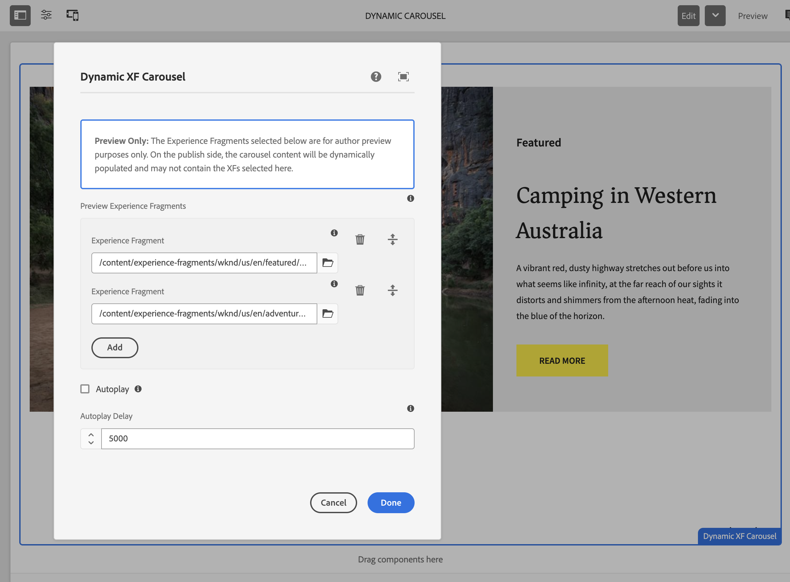
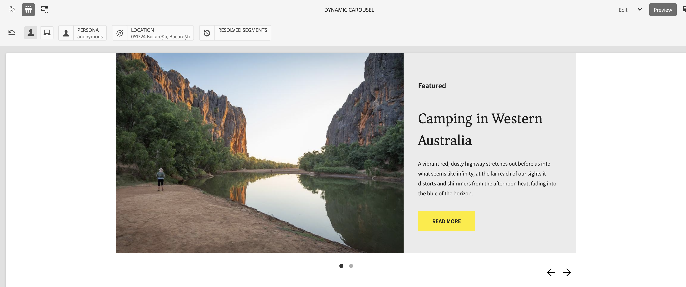

# Dynamic XF Carousel Component

A carousel component that dynamically displays Experience Fragments (XFs). In author mode, it shows preview XFs configured in the dialog. In publish mode, it loads XFs dynamically from an OpenAI context.

## Sample Package Contents

This package needs to be installed on top of the WKND app; it includes:

| Path | Description |
|------|-------------|
| `/apps/wknd/components/dynamicxfcarousel` | The carousel component |
| `/content/experience-fragments/wknd/us/en/DynamicCarousel` | Pre-configured sample XF with the carousel |

## Overview

## How It Works

### Author Mode (Edit/Preview)
1. Authors select Experience Fragments in the component dialog
2. The carousel immediately displays the selected XFs for preview
3. This allows authors to see how the carousel will look with sample content

### Publish Mode
1. Make sure the XFs and all associated assets are published and accessible via CDN
2. The carousel waits for dynamic data from an external source
3. It listens for the `openai:set_globals` event on the window
4. When data arrives, it overrides the preview XFs with dynamic content
5. The carousel then loads and displays the dynamically determined XFs

---

## Step-by-Step Usage Guide

### Step 1: View the Sample Experience Fragment

A pre-configured sample is included at:
```
/content/experience-fragments/wknd/us/en/DynamicCarousel/master
```

1. Open AEM Author and navigate to **Experience Fragments**
2. Browse to `wknd > us > en > DynamicCarousel`
3. Open the **master** variation to see the carousel in action

### Step 2: Configure Preview Experience Fragments

1. Select the Dynamic XF Carousel component on the page
2. Click the **Configure** (wrench) icon to open the dialog



3. You will see a notice:
   > **Preview Only:** The Experience Fragments selected below are for author preview purposes only. On the publish side, the carousel content will be dynamically populated and may not contain the XFs selected here.

4. Click the **+** button to add Experience Fragments
5. Use the XF picker to browse and select Experience Fragments from `/content/experience-fragments`
6. Add as many XFs as needed for preview
7. Optionally configure:
   - **Autoplay**: Enable/disable automatic slide transitions
   - **Autoplay Delay**: Time between slides (default: 5000ms)
8. Click **Done** to save

### Step 3: Preview the Carousel

1. Switch to **Preview** mode in AEM Author
2. The carousel will display the selected Experience Fragments
3. Use the navigation arrows or indicators to browse slides
4. If autoplay is enabled, slides will transition automatically



### Step 5: Publish the content

1. Publish the carousel XF, the XFs and all assets that are expected to be shown
2. On the publish instance, the carousel will:
   - Wait for dynamic data from the `openai:set_globals` event
   - Display the dynamically determined Experience Fragments
   - Fall back to showing an error if no data is received

---

## Sample Configuration

The included sample XF (`DynamicCarousel`) is pre-configured with:

- **Autoplay**: Enabled
- **Delay**: 5000ms (5 seconds)
- **Preview XFs**:
  - `/content/experience-fragments/wknd/us/en/featured/guide-la-skateparks`
  - `/content/experience-fragments/wknd/us/en/adventures/bali-surf-camp`

---

## Dynamic Data Integration

On the publish side, the carousel expects data in this format:

```javascript
window.openai = {
    toolOutput: {
        structuredContent: {
            experiences: [
                "adventures/bali-surf",
                "featured/guide-la-skateparks"
            ]
        }
    }
};

// Dispatch the event to trigger carousel loading
window.dispatchEvent(new Event('openai:set_globals'));
```

The paths should be relative to the base XF path (`/content/experience-fragments/wknd/us/en/`).

---

## Experience Fragment Requirements

For best results, Experience Fragments used in the carousel should:

1. Be located under `/content/experience-fragments/wknd/us/en/`
2. Have a `/master` variation (automatically appended by the component)
3. Be self-contained and render properly in isolation
4. Have appropriate sizing for carousel display

---

## Troubleshooting

| Issue | Solution                                                                    |
|-------|-----------------------------------------------------------------------------|
| "No Experience Fragment paths configured" | Add XFs in the component dialog                                             |
| XF content not loading | Verify the XF path exists and has a `/master` variation                     |
| Images not displaying | Check that image paths are published and accessible from the current domain |
| Carousel not initializing | Check browser console for JavaScript errors                                 |

---

## Technical Details

- **Pure client-side implementation** - No Java/Sling Model required
- **HTL-based** - Uses HTL for server-side rendering
- **Composite multifield** - XF paths stored as child nodes under `xfPaths`
- **Fetch API** - XF content loaded via AJAX
- **Accessible** - ARIA attributes for screen readers

---

## File Structure

### Component
```
/apps/wknd/components/dynamicxfcarousel/
├── .content.xml                 # Component definition
├── _cq_dialog/
│   └── .content.xml            # Author dialog configuration
├── dynamicxfcarousel.html      # Main HTL template with JavaScript
└── DYNAMIC-XF-CAROUSEL.md      # This documentation
```

### Sample Content
```
/content/experience-fragments/wknd/us/en/DynamicCarousel/
└── master/                      # Master variation with pre-configured carousel
```

